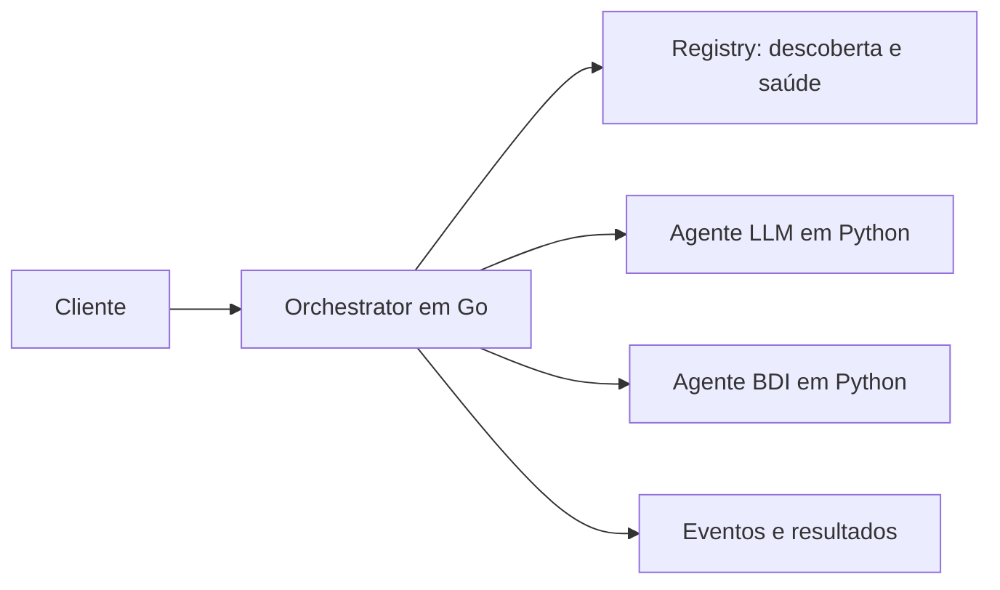

# TG Runtime — cooperação entre agentes heterogêneos

Implementação de referência de um trabalho de graduação sobre
**interoperabilidade entre agentes inteligentes**. O projeto define um contrato
comum para que agentes com arquiteturas diferentes sejam descobertos, recebam
tarefas, troquem mensagens e cooperem em workflows.

O runtime em Go coordena a execução e trata falhas. Os agentes Python mantêm
sua lógica de domínio: um agente LLM pode interpretar uma solicitação e um
agente BDI pode escolher um plano a partir de crenças e restrições.

A comunicação usa gRPC e Protocol Buffers. O contrato `contract.v1` está na
versão `1.0.0`; os stubs Go e Python estão incluídos no repositório.

## Escolha seu caminho

| Quero… | Comece aqui |
|---|---|
| Experimentar sem chave de LLM | [Primeira execução](docs/quickstart.md) |
| Entender como funciona | [Arquitetura e conceitos](docs/architecture.md) |
| Explorar cooperação, falhas e mensagens | [Catálogo de cenários](docs/scenarios.md) |
| Desenvolver ou estender o projeto | [Guia de desenvolvimento](docs/development.md) |
| Avaliar o trabalho de graduação | [Guia de avaliação e evidências](docs/evaluation.md) |

## Primeira experiência

Com Docker e Docker Compose v2, a demonstração básica executa uma tarefa
`echo` pelo Registry, Orchestrator e agente mock, sem chave de LLM nem
instalação local de Go ou Python. A primeira preparação baixa dependências e
constrói imagens.

O [guia de primeira execução](docs/quickstart.md) reúne os comandos, a
verificação de prontidão, o resultado esperado e o encerramento do ambiente.
Depois, o [workflow sequencial](scenarios/workflow-sequential/README.md)
demonstra a coordenação de duas tarefas.

## O que está implementado

- Registro e descoberta por capacidade, heartbeat e detecção de falhas.
- Seleção de agentes, timeout por tentativa, retry e reassignment.
- Workflows com dependências, bindings de resultados, paralelismo e API assíncrona.
- Mensageria em memória entre agentes.
- SDK Python com `Agent`, `BdiAgent`, `LlmAgent` e `Scenario`.
- Cenários executáveis, benchmarks A–E e comparação logística BDI/LLM/híbrido.

É um protótipo de pesquisa para experimentos locais. Estado em memória,
mensageria sem reentrega e dependência do provedor LLM são limites relevantes;
veja [escopo e limitações](docs/limitations.md).

## Navegação

O [índice da documentação pública](docs/README.md) organiza os guias e a
referência técnica. O [mapa do código](docs/development.md#mapa-do-repositório)
indica os pontos de entrada da implementação. A licença é [Apache 2.0](LICENSE).
