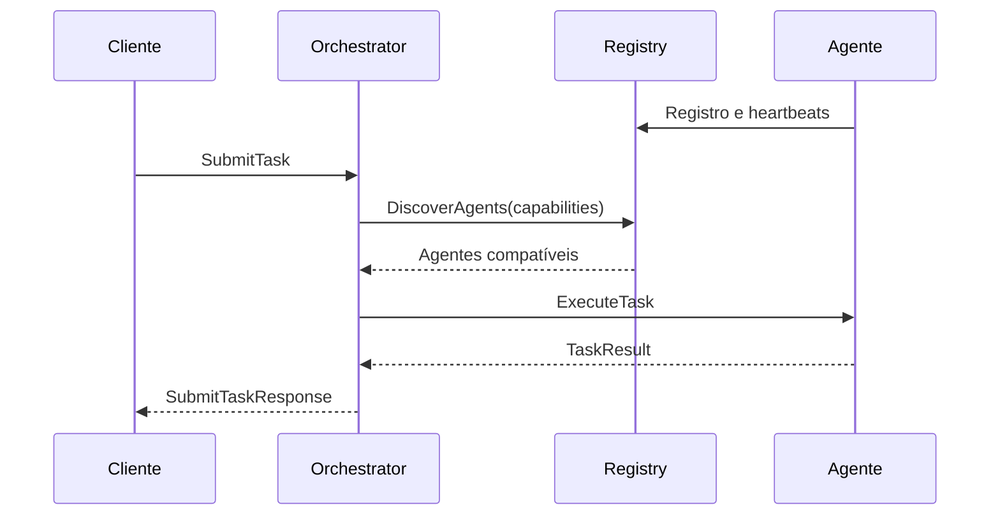

# Arquitetura e conceitos

O contrato define a comunicação comum. O runtime coordena tarefas usando esse
contrato. Cada agente implementa seu próprio raciocínio de domínio.

## Componentes

| Componente | Responsabilidade | Código |
|---|---|---|
| Contrato | Mensagens e serviços gRPC compartilhados | [contract.proto](../proto/contract/v1/contract.proto) |
| Registry | Cadastro, descoberta por capacidade, heartbeat e detecção de falhas | [registry](../runtime/services/registry/cmd/main.go) |
| Orchestrator | Seleção, execução, retry, planejamento delegado e workflows | [orchestrator](../runtime/services/orchestrator/internal/server/server.go) |
| Messaging | Publicação e recebimento por destinatário, em memória | [messaging](../runtime/services/messaging/internal/server/server.go) |
| SDK Python | Modelos, registro, servidor do agente, heartbeat e clientes | [tg_sdk](../sdk/python/src/tg_sdk/__init__.py) |
| Agentes | Interpretação, planejamento de domínio e tarefas de teste | [catálogo](scenarios.md) |
| Eventos e análise | Registro da execução e extração de métricas | [logger](../runtime/services/internal/events/logger.go), [métricas](../experiments/scripts/compute_metrics.py) |

O detector de falhas faz parte do processo Registry; não é um serviço separado.
Registry e workflows armazenam estado em memória. Os eventos são arquivos JSONL.

## Tarefa simples

O executor aplica seleção e timeout. Quando a política permite, uma falha
leva a nova descoberta e tentativa, podendo excluir agentes que já falharam.
O [executor](../runtime/services/orchestrator/internal/execution/executor.go)
é compartilhado por tarefas simples e etapas de workflows.

## Workflow heterogêneo

No cenário de rotas, o cliente envia uma pergunta com a capacidade
`task-decomposition`. Esse pedido explícito aciona o planner do runtime:

1. Um agente LLM devolve a definição estruturada de um workflow.
2. O runtime valida dependências, limites e bindings.
3. O agente BDI escolhe uma rota.
4. Um binding entrega o resultado à etapa LLM de explicação.
5. O runtime agrega o resultado do workflow.

O runtime também aceita um workflow definido pelo cliente, sem planner LLM.
Etapas independentes podem rodar em paralelo. A API assíncrona permite iniciar,
consultar e cancelar uma execução; o acompanhamento atual usa polling.

O cenário logístico híbrido usa um workflow explícito diferente: LLM interpreta
restrições e BDI planeja a missão. A simulação ocorre no domínio e no avaliador,
não como controle de um robô físico.

## Mensagens e workflows

Workflows chamam `AgentService.ExecuteTask` diretamente. A mensageria atende
outro caminho: um `MessagingClient` publica para um destinatário e outro recebe
por stream. Ela é complementar, sem ser pré-requisito para encadear tarefas.

## Glossário

| Termo | Significado neste projeto |
|---|---|
| Capability | Identificador de uma capacidade anunciada pelo agente e requerida pela tarefa |
| Task | Unidade de trabalho com objetivo, payload e campos operacionais |
| Workflow / step | Grafo de tarefas com dependências / uma etapa desse grafo |
| Binding | Cópia controlada de um campo do resultado anterior para o payload seguinte |
| Trace | Identificação usada para correlacionar a execução |
| Heartbeat | Atualização periódica da saúde e carga do agente |
| Retry / reassignment | Nova tentativa / nova atribuição após falha, conforme a política |
| BDI | Crenças, desejos e intenções; aqui, uma abstração simplificada em Python |
| LLM | Modelo usado por um agente para interpretação, planejamento estruturado ou explicação |

[Referência técnica](reference.md) · [Limitações](limitations.md) · [Índice](README.md)
